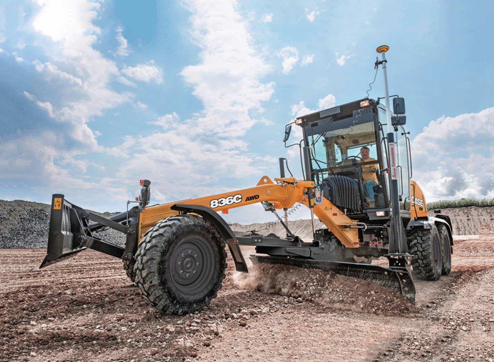

> Click on GIF for YouTube video

# **DE⫶TR**: End-to-End Object Detection and Panoptic Segmentation with Transformers on Custom Dataset

An attempt to train DETR on Custom Dataset of Construction Classes (about 50), for Object Detection and Panoptic Segmentation.

Achieved following results:

IoU metric: bbox

| Metric                  | IoU Range | maxDetections | Value |
| ----------------------- | --------- | ------------- | ----- |
| Average Precision  (AP) | 0.50:0.95 | 100           | 0.609 |
| Average Recall     (AR) | 0.50:0.95 | 100           | 0.86  |

Segmentation Metric: Panoptic, Segmentation, Recognition Quality

|        | PQ   | SQ   | RQ   | N    |
| ------ | ---- | ---- | ---- | ---- |
| All    | 54.6 | 79.3 | 60.8 | 63   |
| Things | 62.3 | 83.5 | 68.6 | 48   |
| Stuff  | 29.9 | 65.8 | 35.8 | 15   |

Let's go deep into the process now:

First let's wonder and understand how DETR works and ponder on few questions.

[Understanding DETR](https://abdksyed.github.io/blog/detr/panoptic%20segmentation/object%20detection/2021/09/30/DETR.html)

[Few Questions to Ponder](https://abdksyed.github.io/blog/detr/panoptic%20segmentation/object%20detection/2021/09/30/DETR-QA.html) 

Now, we know how DETR works and what are the components, let's see how we create our Custom Dataset/

[Creating Custom Dataset](https://abdksyed.github.io/blog/custom%20dataset/object%20detection/panoptic%20segmentation/coco/detr/2021/09/30/CustomDataset.html)

Now, we can train first for the Object Detection.

[Training(maybe, finetuning) for Object Detection](https://abdksyed.github.io/blog/custom%20dataset/object%20detection/panoptic%20segmentation/coco/detr/2021/10/02/ObjectDetection-DETR.html)

Yayyy, now we have well trained, object detector for `Things` and `Stuff` classes, now we can freeze the detection weights and train our Panoptic model.

[DETR Panoptic Segmentation](https://abdksyed.github.io/blog/custom%20dataset/object%20detection/panoptic%20segmentation/coco/detr/2021/10/03/PanopticSegmentation-DETR.html) 

And, that's it for now. We shall try to implement few more things in the coming future, like applying RICAP for better detection results, use Mixed Precision, Change Number of Queries and do other Ablation study. Also, maybe now move to Deformable DETR which claims to be faster training than DETR.

Sayo Nara!

### Acknowledments:
All Drawings done on [draw.io](https://app.diagrams.net/)  
DETR Paper: [arxiv](https://arxiv.org/abs/2005.12872)  
Excellent Demo from Author: [Video](https://www.youtube.com/watch?v=utxbUlo9CyY)  
Great Explanation on Paper: [Yanic](https://www.youtube.com/watch?v=T35ba_VXkMY) [AI Epiphany](https://www.youtube.com/watch?v=BNx-wno-0-g)

