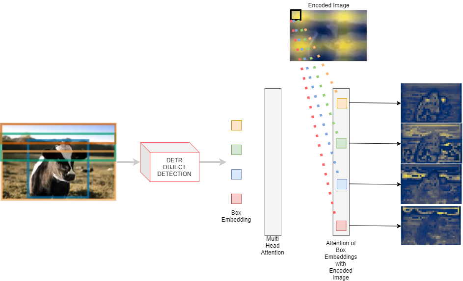

### We take the encoded image (dxH/32xW/32) and send it to Multi-Head Attention (**FROM WHERE DO WE TAKE THIS ENCODED IMAGE?**)

The encoded image *d x H/32 x W/32* is the image which is the output of the ***transformer encoder***. When the final feature map from ResNet-5 block is taken the shape of the feature map is *d x H/32 x W/32* and it is converted to embeddings by flattening it on H and W, and transposing it to become, 196x256 (HW x 256) as Transformers accept such sequential embeddings. This embeddings after passed through the 6 layer encoder maintains it's shape, if 196x256, and this final encoded 196x256 is again re-arranged to form the Encoded Image which after completion of object detection is sent to a Multi-head attention layer along with bounding box embeddings.  

###### We than along with dxN Box embeddings send the encoded Image to the Multi-Head Attention

### We do something here to generate N x M x H/32 x W/32 maps. (**WHAT DO WE DO HERE?**)

We perform a **Multi Head Attention** with the Bounding Box embeddings and the encoded image from the Transformer encoder. 

The each box embeddings are dot product with the encoded image, using *M* attention heads to get the desired *N x M x H/32 x W/32* attention heatmap, where N are the number of objects detected in the detection pipeline. 

 ### Then we concatenate these maps with Res5 Block (**WHERE IS THIS COMING FROM?**)

After getting the attention maps which are small resolution, H/32 and W/32 needs to be up sampled to get the final segmentation image. To achieve the final prediction and increase the resolution, we use a similar concept of Feature Pyramid Networg

Before all, this during the first step of sending the image through the ResNet-50 backbone, we set aside the feature maps after every ResNet block, i.e. after each block of ResNet the output feature maps are saved in separate place, to be used here in the FPN

* Res Block 2 -> H/4 x W/4
* Res Block 3 -> H/8 x W/8
* Res Block 4 -> H/16 x W/16
* Res Block 5 -> H/32 x W/32

FPN-style Network:

​	The attention maps are send through a convolutional network, where at first the attention maps are concatenated with the respective size Res Block, i.e., in the beginning the Attention map is of size H/32 x W/32, so the Res5 block which have the feature maps of same size are concatenated. 

Hence the Res5/Res4/Res3/Res2 feature maps are coming from the Backbone CNN which was used initially to generate the image embeddings, where each feature map was saved and set aside after every block.

### Then we perform the above steps (**EXPLAIN THESE STEPS**)

As mentioned above, the attention maps after Multi-Head Attention is concatenated with Res5 block feature maps and is send through a two set of Conv-Norm-Activation layer and than upsampled to become H/16 x W/16. Again the similar process is repeated where corresponding feature maps from ResNet blocks are added and send though Conv-Norm-Activation Layers, and finally a Conv-Norm-Activation-Conv layer is added to get the final attention maps. Here although we use the HxW image, the final attention maps are of the size H/4 x W/4, since in the beginning of ResNet it self we downsample the image by 4 times, hence that's the final Mask Logits are 4 times smaller.

The Convolutions are all 3x3 Kernels, and the Normalization being used is Group Normalization and ReLU activation is performed after every Conv-Norm.

### RESULT

This than is passed though Pixel-wise Argmax and concatenated to get the final Panoptic Segmentation Mask.

Acknowledments:
Huge Thanks to [draw.io](https://app.diagrams.net/)  
DETR Paper: [arxiv](https://arxiv.org/abs/2005.12872)  
Excellent Demo from Author: [Video](https://www.youtube.com/watch?v=utxbUlo9CyY)  
Great Explanation on Paper: [Yanic](https://www.youtube.com/watch?v=T35ba_VXkMY) [AI Epiphany](https://www.youtube.com/watch?v=BNx-wno-0-g)
